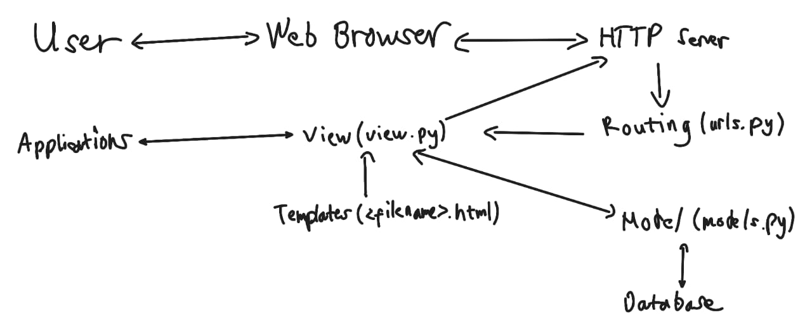

<details>
<Summary><b>Tugas 2</b></Summary>
"footballshop" 
Langkah A. Dasar Git

1. Buat repo di GitHub.
2. Inisialisasi lokal dengan git init.
3. Tambah file → buat README.md.
4. Add & commit.
5. Hubungkan remote.
6. Push ke GitHub.
7. Clone repo lain.
8. Branching.
9. Merge di GitHub.

Langkah B. Buat Proyek Django
1. Siapkan folder baru.
2. Aktifkan virtualenv
3. Buat requirements.txt.
4. Install dependencies.
5. Start project Django.
6. Buat file .env dan isi PRODUCTION=False.
7. Buat file .env.prod dan isi kredensial PostgreSQL dari ITF UI.
8. Ubah settings.py. Load dotenv, set ALLOWED_HOSTS, konfigurasi DB sesuai PRODUCTION.
9. Migrasi DB.
10. Jalankan server, lalu cek di localhost:8000.
11. Matikan server.
12. Tambahkan 'main' ke INSTALLED_APPS di settings.py.
13. Buat folder main/templates/ dan file main.html.
14. Buat model Shop, lalu tambahkan atribut, kategori, dan fungsi yang sesuai.
15. Jalankan migrasi.
16. Edit main/views.py dengan data diri.
17. Edit template main.html dengan ganti isi hardcode dengan variable Django.
18. Edit berkas urls.py di direktori proyek (footballshop).
19. Jalankan server dan buka di browser.

Langkah C. Push ke PWS
1. Langkah pertama adalah membuka situs https://pbp.cs.ui.ac.id, lalu login menggunakan akun SSO UI.
2. Selanjutnya buat proyek baru dengan menekan tombol Create New Project.
3. Simpan project Credentials dan Project Command.
4. Kemudian pilih proyek yang sudah dibuat di sidebar, lalu buka tab Environs dan klik Raw Editor. Salin isi file .env.prod ke editor, lalu tekan Update All Variables.
5. Selanjutnya buka file settings.py pada proyek Django, kemudian tambahkan URL deployment ke dalam ALLOWED_HOSTS. Format URL adalah <username-sso>-<nama-proyek>.pbp.cs.ui.ac.id, dengan titik pada username diganti menjadi strip dan tanpa _ karena saya salah disitu.
6. Simpan perubahan ini, lalu jalankan git add, git commit, dan git push origin master. Setelah itu jalankan perintah dari Project Command di PWS dan login menggunakan credentials PWS.

Buatlah bagan yang berisi request client ke web aplikasi berbasis Django beserta responnya dan jelaskan pada bagan tersebut kaitan antara urls.py, views.py, models.py, dan berkas html.


Jelaskan peran settings.py dalam proyek Django?
Migrasi database di Django adalah mekanisme untuk menyinkronkan perubahan model Python dengan struktur database. Setiap perubahan pada model dicatat dalam file migrasi yang berisi instruksi perubahan skema, lalu diterjemahkan Django menjadi query SQL sesuai jenis database yang digunakan. Dengan konsep ini, database dapat berkembang mengikuti kode secara bertahap tanpa kehilangan data yang sudah ada, karena proses pembuatan, pengubahan, atau penghapusan tabel dilakukan secara terkontrol.

Bagaimana cara kerja migrasi database di Django?
Migrasi di Django adalah proses untuk menyamakan definisi model dalam kode Python dengan struktur database yang digunakan. Pertama, developer mendefinisikan atau mengubah model pada file models.py. Kedua, perintah python manage.py makemigrations digunakan untuk membuat file migrasi yang berisi instruksi perubahan database dalam bentuk Python. Ketiga, perintah python manage.py migrate mengeksekusi file migrasi tersebut sehingga struktur database benar-benar diperbarui sesuai dengan definisi model. Dengan sistem ini, developer tidak perlu menulis query SQL secara manual.

Menurut Anda, dari semua framework yang ada, mengapa framework Django dijadikan permulaan pembelajaran pengembangan perangkat lunak?
Django sering dijadikan framework awal untuk pembelajaran karena sifatnya yang lengkap dan terstruktur. Django menggunakan pola MVT (Model-View-Template) yang memperkenalkan konsep penting dalam pengembangan perangkat lunak, seperti pemisahan logika bisnis, data, dan tampilan. Selain itu, Django memiliki banyak fitur bawaan seperti sistem autentikasi, ORM, dan template engine, sehingga pemula bisa langsung membangun aplikasi nyata tanpa harus menambahkan banyak library eksternal. Django juga menekankan best practices dalam penulisan kode, memiliki komunitas besar, serta dokumentasi yang sangat baik, sehingga cocok sebagai dasar sebelum mempelajari framework lain.

Apakah ada feedback untuk asisten dosen tutorial 1 yang telah kamu kerjakan sebelumnya?
Asdos sudah menjelaskan tutorial dengan legkap dan mudah dimengerti.
</details>

<details>
<Summary><b>Tugas 3</b></Summary>
Langkah-Langkah Tugas 3: 
A. Form dan Data Delivery

1. Buat direktori templates di root project.
2. Buat file `base.html` dengan isi template dasar:
3. Atur `settings.py` → tambahkan `DIRS: [BASE_DIR / 'templates']` di bagian `TEMPLATES`.
4. Ubah `main/templates/main.html` agar extend `base.html`.
---

B. Membuat Form Input Data (Product)
1. Buat file `forms.py` di direktori `main`:
2. Update `views.py`:

   * Tambahkan fungsi `show_main`, `create_product`, dan `show_products`.
3. Update `urls.py` di `main`:
4. Update `main/templates/main.html` untuk menampilkan daftar berita + tombol tambah.
5. Buat `create_product.html` (form tambah product).
6. Buat `product_detail.html` (halaman detail product).
---

C. Atur CSRF Trusted Origins
Di `settings.py`, tambahkan:
```
CSRF_TRUSTED_ORIGINS = [
    "https://rafalah-izak-footballshop.pbp.cs.ui.ac.id"
]
```
---

D. Mengembalikan Data dalam Bentuk XML
1. Tambahkan fungsi di `views.py`:

   ```
   from django.http import HttpResponse
   from django.core import serializers

   def show_xml(request):
       product_list = product.objects.all()
       xml_data = serializers.serialize("xml", product_list)
       return HttpResponse(xml_data, content_type="application/xml")
   ```
2. Tambahkan URL di `urls.py`:

   ```
   path('xml/', show_xml, name='show_xml'),
   ```
3. Coba buka `http://localhost:8000/xml/`.

---

E. Mengembalikan Data dalam Bentuk JSON

1. Tambahkan fungsi di `views.py`:

   ```
   def show_json(request):
       product_list = Product.objects.all()
       json_data = serializers.serialize("json", product_list)
       return HttpResponse(json_data, content_type="application/json")
   ```
2. Tambahkan URL di `urls.py`:

   ```
   path('json/', show_json, name='show_json'),
   ```
3. Coba buka `http://localhost:8000/json/`.

---

F. Mengembalikan Data Berdasarkan ID

1. Tambahkan fungsi di `views.py`:

   ```
   def show_xml_by_id(request, id):
       try:
           product_item = Product.objects.filter(pk=id)
           xml_data = serializers.serialize("xml", product_item)
           return HttpResponse(xml_data, content_type="application/xml")
       except product.DoesNotExist:
           return HttpResponse(status=404)

   def show_json_by_id(request, id):
       try:
           product_item = Product.objects.get(pk=id)
           json_data = serializers.serialize("json", [product_item])
           return HttpResponse(json_data, content_type="application/json")
       except product.DoesNotExist:
           return HttpResponse(status=404)
   ```
2. Tambahkan URL di `urls.py`:

   ```
   path('xml/<str:product_id>/', show_xml_by_id, name='show_xml_by_id'),
   path('json/<str:product_id>/', show_json_by_id, name='show_json_by_id'),
   ```
3. Coba akses `http://localhost:8000/xml/1/` atau `http://localhost:8000/json/1/`.

---

G. Gunakan Postman untuk Mengecek

1. Buka Postman → buat request `GET` ke:

   * `http://localhost:8000/xml/`
   * `http://localhost:8000/json/`
2. Klik Send, lihat response dalam format XML atau JSON.
3. Bisa juga coba dengan `/xml/<id>` atau `/json/<id>`.

---

H. Push ke GitHub & PWS

```
git add .
git commit -m
git push origin master
git push pws master
```

---

Mengapa kita memerlukan data delivery dalam pengimplementasian sebuah platform?

* Platform modern (misalnya e-commerce, media sosial, atau sistem kampus) biasanya punya banyak komponen: frontend (UI), backend (server), database, bahkan aplikasi mobile.
* Data delivery = cara mengirim dan menerima data antar komponen tersebut.
* Tanpa mekanisme ini, frontend tidak bisa menampilkan data dari database, dan aplikasi mobile tidak bisa sinkron dengan server.

Jadi, data delivery itu penting supaya sistem bisa komunikasi dan sinkron antar bagian.

Mana yang lebih baik antara XML dan JSON? Mengapa JSON lebih populer?

* XML:
  ✔️ Bagus untuk data yang kompleks & terstruktur hierarkis, mendukung atribut, namespace.
  ❌ Lebih berat, verbose (tag panjang), parsing lebih lambat.

* JSON:
  ✔️ Ringkas, mudah dibaca manusia, parsing cepat.
  ✔️ Native support di JavaScript (jadi gampang dipakai di web).
  ✔️ Lebih hemat bandwidth karena formatnya lebih ringan.
  ❌ Kurang bagus untuk data dengan metadata/atribut yang kompleks (dibanding XML).

Karena web modern butuh cepat, ringan, efisien, maka JSON lebih populer. Hampir semua REST API default-nya pakai JSON.

Fungsi dari method `is_valid()` pada form Django

Django punya sistem form untuk validasi input user.
Method `is_valid()`:
* Mengecek apakah semua field sudah diisi sesuai aturan (misalnya email valid, angka tidak negatif, field wajib tidak kosong).
* Jika valid → form bersih (cleaned data) bisa dipakai untuk disimpan ke database.
* Jika tidak valid → akan mengisi `form.errors` dengan pesan error.

Tanpa `is_valid()`, aplikasi bisa menyimpan data yang salah/berbahaya ke database (misalnya string di field umur).

Mengapa kita membutuhkan `csrf_token` pada form di Django?

* CSRF (Cross-Site Request Forgery) adalah serangan di mana penyerang membuat user tanpa sadar mengirim request berbahaya ke server yang sudah dipercaya.
* Django menambahkan `csrf_token` (random unik untuk tiap session) ke dalam setiap form.
* Server hanya menerima request yang punya token valid → mencegah request palsu.

Apa yang terjadi jika tidak ada `csrf_token`?

* Penyerang bisa bikin halaman palsu yang otomatis mengirim form ke server (misalnya transfer uang, ubah password).
* Karena user sudah login, request itu bisa berhasil tanpa sepengetahuan user.

Dengan `csrf_token`, request palsu itu akan ditolak server.

.png>) 
.png>) 
.png>) 
.png>)

Apakah ada feedback untuk asdos di tutorial 2 yang sudah kalian kerjakan?
Tidak ada, asdos sudah menjelaskan dengan baik
</details>

<details>
<Summary><b>Tugas 4</b></Summary>

1. Django AuthenticationForm
`AuthenticationForm` adalah form bawaan Django untuk proses login user. Form ini secara otomatis memvalidasi:

* Apakah username ada di database.
* Apakah password sesuai (menggunakan hash, bukan plaintext).
* Apakah user aktif (tidak dinonaktifkan).

Kelebihan:
* Mudah digunakan, sudah jadi dan tinggal diimpor.
* Terintegrasi dengan sistem autentikasi Django.
* Aman secara default karena mengikuti praktik terbaik.
* Bisa dikustomisasi dengan menambahkan field baru.

Kekurangan:
* Kurang fleksibel untuk metode login selain username/password (misalnya login dengan email atau OAuth).
* Tampilan standar, biasanya perlu dikustomisasi untuk kebutuhan UI/UX.

2. Perbedaan Autentikasi dan Otorisasi
* Autentikasi adalah proses memastikan identitas user, misalnya saat login dengan username dan password.
* Otorisasi adalah proses memastikan hak akses user, misalnya apakah user boleh menghapus produk.

Implementasi di Django:
* Autentikasi:
  * Disediakan oleh `django.contrib.auth`.
  * Menggunakan form seperti `AuthenticationForm`, `UserCreationForm`.
  * Middleware `AuthenticationMiddleware` menambahkan `request.user`.

* Otorisasi:
  * Sistem permission (`is_superuser`, `is_staff`, `has_perm`).
  * Dekorator `@login_required` untuk memastikan hanya user yang login yang dapat mengakses.
  * Dekorator `@permission_required('app.permission_name')` untuk hak akses lebih spesifik.

3. Kelebihan dan Kekurangan Session dan Cookies
Cookies
Kelebihan:
* Ringan dan langsung tersedia di client.
* Tidak membebani server karena disimpan di sisi client.
* Bisa diakses JavaScript untuk kebutuhan tertentu.

Kekurangan:
* Mudah diubah oleh user sehingga tidak aman untuk data sensitif.
* Ada batas ukuran (sekitar 4KB per cookie).
* Rentan terhadap serangan XSS jika tidak diamankan.

Sessions
Kelebihan:
* Lebih aman karena data asli tidak ada di client, hanya session ID.
* Bisa menyimpan data lebih besar dan kompleks.
* Terintegrasi penuh dengan Django melalui `request.session`.

Kekurangan:
* Membebani server karena data disimpan di sisi server.
* Membutuhkan mekanisme untuk menghapus session yang sudah kadaluarsa.

4. Keamanan Cookies dan Penanganan Django
Secara default cookies tidak sepenuhnya aman karena berisiko:
* Cross-Site Scripting (XSS) dapat mencuri cookies.
* Session hijacking jika session ID dicuri.
* Man-in-the-middle attack jika cookie dikirim tanpa HTTPS.

Django menangani hal ini dengan:
* Pengaturan keamanan bawaan:
  * `SESSION_COOKIE_SECURE = True` → cookie hanya dikirim lewat HTTPS.
  * `SESSION_COOKIE_HTTPONLY = True` → cookie tidak bisa diakses oleh JavaScript.
  * `CSRF_COOKIE_SECURE = True` → CSRF token hanya dikirim lewat HTTPS.
  * `CSRF_COOKIE_HTTPONLY = True`.
* Proteksi CSRF otomatis dengan ``.
* Password hashing menggunakan algoritma kuat.
* Framework session untuk memastikan data penting tetap tersimpan di server, bukan di cookie.

5. Langkah-Langkah Tugas 4:
A. Membuat Fungsi dan Form Registrasi
1. Modifikasi views.py untuk import UserCreationForm dan messages, serta menambahkan fungsi register
2. Buat template register.html dengan mengextend dari base.html
3. Konfigurasi URLs untuk menambah path register

B. Membuat Fungsi Login
1. Modifikasi views.py untuk login dengan import AuthenticationForm, authenticate, dan login, serta membuat fungsi login_user
2. Buat template login.html dengan mengextend dari base.html
3. Konfigurasi URLs untuk login dengan menambahkan import dari views dan membuat path baru

C. Membuat Fungsi Logout
1. Modifikasi views.py untuk logout dengan import logout dan membuat fungsi logout-user
2. Tambahkan tombol logout di main.html
3. Konfigurasi URLs untuk logout dengan import dari views dan membuat path baru

D. Merestriksi Akses Halaman
1. Tambahkan decorator login_required di views untuk fungsi show_main dan show_products

E. Menggunakan Data dari Cookies
1. Modifikasi fungsi login untuk set cookie dengan import datetime, HttpResponseRedirect, dan reverse, serta modifikasi blok if form.is_valid() di fungsi login_user
2. Tampilkan last_login di context pada fungsi show_main
3. Tampilkan last_login di template main.html
4. Modifikasi fungsi logout untuk hapus cookie

F. Menghubungkan Model Product dengan User
1. Modifikasi model Product dengan menambah field user dan import User
2. Jalankan migration
3. Modifikasi fungsi create_product sehingga harus login_required
4. Modifikasi fungsi show_main dengan filter
5. Tambahkan tombol filter di main.html
6. Tampilkan author di product_detail.html

Finalisasi
```
git add .
git commit -m
git push origin master
git push pws master
```
<details>

<details>
<Summary><b>Tugas 5</b></Summary>

1. Urutan Prioritas CSS Selector
Jika terdapat beberapa CSS selector yang mengatur elemen HTML yang sama, browser menggunakan aturan prioritas berikut:

* Inline styles (ditulis langsung pada atribut `style` di elemen HTML) memiliki prioritas tertinggi.
* ID selector (`#id`) lebih kuat dibandingkan class, pseudo-class, dan element selector.
* Class selector (`.class`), pseudo-class (`:hover`, `:active`, dll.), dan attribute selector lebih kuat daripada element selector.
* Element selector (`div`, `p`, `h1`) memiliki prioritas terendah.
* Jika prioritas sama, maka aturan yang ditulis terakhir akan berlaku.

2. Pentingnya Responsive Design
Responsive design memastikan tampilan website menyesuaikan ukuran layar (desktop, tablet, mobile). Tanpa ini, user experience akan buruk karena tampilan bisa berantakan.
* Contoh aplikasi yang sudah menerapkan responsive design:
  * Tokopedia → Tampilan rapi di desktop dan mobile, menu navigasi berubah menjadi hamburger menu di layar kecil.
* Contoh aplikasi yang belum menerapkan responsive design:
  * https://www.tagteamsigns.com/ → ketika dibuka di mobile, teks terlalu kecil, gambar kepotong, dan user harus zoom in/out.

Dengan responsive design, aplikasi lebih mudah diakses, meningkatkan kenyamanan pengguna, serta memperluas jangkauan.

3. Perbedaan Margin, Border, dan Padding
* Margin: Ruang di luar elemen, memisahkan elemen dengan elemen lain.
* Border: Garis yang membungkus elemen, berada di antara margin dan padding.
* Padding: Ruang di dalam elemen, antara konten dan border.

Implementasi contoh CSS:
```
.box {
  margin: 20px;     /* jarak antar elemen */
  border: 2px solid black;  /* garis di sekeliling elemen */
  padding: 15px;    /* ruang antara isi elemen dan border */
}
```

4. Flexbox dan Grid Layout
* Flexbox (Flexible Box Layout):
  Digunakan untuk menyusun elemen dalam satu arah (baris atau kolom). Sangat cocok untuk layout yang dinamis, misalnya navbar, daftar item horizontal/vertical.
  ```
  .flex-container {
    display: flex;
    justify-content: space-between; /* posisi horizontal */
    align-items: center; /* posisi vertical */
  }
  ```

* Grid Layout:
  Digunakan untuk menyusun elemen dalam baris dan kolom. Cocok untuk layout kompleks seperti galeri, dashboard, atau product listing.
  ```
  .grid-container {
    display: grid;
    grid-template-columns: repeat(3, 1fr); /* 3 kolom */
    gap: 10px;
  }
  ```
Kesimpulan:
* Gunakan flexbox untuk alignment 1D (horizontal/vertical).
* Gunakan grid untuk layout 2D (baris dan kolom).

Langkah-Langkah Tutorial Django

1. Setup Tailwind di Django
- Buka file `templates/base.html`.
- Tambahkan meta viewport.
- Tambahkan CDN Tailwind.

2. Fitur Edit Products
- Di `views.py` → buat fungsi `edit_products`.
- Buat template `edit_products.html`.
- Tambahkan URL.
- Tambahkan tombol Edit di `main.html`.

3. Fitur Delete Products
- Di `views.py` → buat fungsi `delete_products`.
- Tambahkan URL.
- Tambahkan tombol Delete di `main.html`.

4. Membuat Navigation Bar
- Buat file `templates/navbar.html`.
- Isi dengan struktur navbar (judul, menu, login/logout).
- Tambahkan ke `main.html` dengan :

5. Konfigurasi Static Files
- Di `settings.py`, tambahkan `WhiteNoiseMiddleware`.
- Tambahkan:
   ```
   STATIC_URL = '/static/'
   if DEBUG:
       STATICFILES_DIRS = [BASE_DIR / 'static']
   else:
       STATIC_ROOT = BASE_DIR / 'static'
   ```

6. Styling Global
- Buat `static/css/global.css`.
- Tambahkan CSS custom untuk form & checkbox.
- Hubungkan di `base.html`.

7. Styling Navbar (Responsive)
- Update `navbar.html` → gunakan Tailwind class + tombol hamburger.
- Tambahkan untuk toggle mobile menu.

8. Styling Halaman Login
- Ubah `login.html` dengan layout Tailwind (form + error message).

9. Styling Halaman Register
- Ubah `register.html` dengan form Tailwind (form + error message + link login).

10. Styling Halaman Home
- Buat file `card_product.html` untuk tampilan tiap produk.
- Tambahkan tampilan empty state (`no-product.png`) di `/static/image`.
- Update `main.html` → gunakan include `card_product.html`.

11. Melakukan add-commit-push ke GitHub.
<details>

<details>
<Summary><b>Tugas 6</b></Summary>
1. Apa perbedaan antara synchronous request dan asynchronous request?
Synchronous request berarti permintaan dari browser ke server berjalan secara berurutan. Browser akan menunggu respon dari server sebelum melanjutkan ke perintah berikutnya. Akibatnya, selama proses ini berlangsung, pengguna tidak bisa berinteraksi dengan halaman karena halaman dibekukan sementara atau direload.

Sebaliknya, asynchronous request memungkinkan browser mengirim permintaan ke server di latar belakang tanpa menghentikan interaksi pengguna. Dengan cara ini, halaman tidak perlu direload untuk memperbarui sebagian konten. AJAX (Asynchronous JavaScript and XML) adalah contoh penerapan asynchronous request.

Contohnya, ketika form dikirim secara biasa menggunakan `<form action="..." method="POST">`, halaman akan direload setelah dikirim (synchronous). Namun, jika dikirim dengan `fetch()` atau `XMLHttpRequest`, data dikirim tanpa reload halaman (asynchronous).

2. Bagaimana AJAX bekerja di Django (alur request–response)?
Proses kerja AJAX di Django terjadi dalam beberapa langkah. Pertama, pengguna melakukan tindakan di halaman, misalnya menekan tombol “Add Product”. JavaScript kemudian mengeksekusi fungsi yang mengirim data ke server menggunakan `fetch()` atau `XMLHttpRequest`. Django menerima request tersebut melalui view (biasanya dengan decorator seperti `@require_POST`), lalu memproses data sesuai logika yang dibuat.

Berbeda dari render biasa, Django tidak mengirim HTML kembali, tetapi mengembalikan data dalam format JSON. Setelah menerima JSON dari server, JavaScript menampilkan hasilnya langsung ke halaman dengan memanipulasi DOM, tanpa harus memuat ulang seluruh halaman.

Secara singkat, alurnya adalah:
User Action → JavaScript → AJAX Request → Django View → JSON Response → Update DOM

3. Apa keuntungan menggunakan AJAX dibandingkan render biasa di Django?
Penggunaan AJAX memiliki beberapa keunggulan dibanding render halaman penuh.
Pertama, tidak perlu reload halaman, sehingga interaksi terasa lebih cepat dan efisien.
Kedua, hanya bagian tertentu dari halaman yang diperbarui, bukan seluruh halaman, sehingga lebih hemat waktu dan bandwidth.
Ketiga, pengalaman pengguna menjadi lebih baik karena interaksi terasa lancar dan modern.
Terakhir, AJAX sangat cocok digunakan pada aplikasi dengan konsep Single Page Application (SPA), di mana semua interaksi terjadi dalam satu halaman.

4. Bagaimana cara memastikan keamanan saat menggunakan AJAX untuk fitur Login dan Register di Django?
Dalam penggunaan AJAX untuk login dan registrasi, keamanan tetap menjadi hal utama. Django sudah menyediakan perlindungan CSRF (Cross-Site Request Forgery) untuk mencegah penyalahgunaan request. Pastikan token CSRF dikirim bersama setiap request POST, misalnya dengan menambahkan header `"X-CSRFToken"`.

Selain itu, koneksi harus menggunakan HTTPS agar data seperti kata sandi tidak bocor saat dikirim. Validasi input tetap harus dilakukan di sisi server, bukan hanya di JavaScript, untuk mencegah manipulasi data. Django juga harus memastikan data sensitif seperti password hash tidak dikembalikan ke client melalui JSON.
Terakhir, gunakan decorator seperti `@login_required` atau sistem izin untuk memastikan hanya pengguna sah yang dapat mengakses data melalui AJAX.

5. Bagaimana AJAX mempengaruhi pengalaman pengguna (User Experience) pada website?
AJAX membuat pengalaman pengguna menjadi lebih cepat, interaktif, dan efisien. Dengan AJAX, halaman tidak perlu direload untuk memperbarui konten. Misalnya, saat pengguna menambahkan produk baru, produk tersebut langsung muncul di daftar tanpa harus memuat ulang halaman.

Hal ini menciptakan pengalaman yang lebih alami dan menyenangkan karena pengguna tidak perlu menunggu lama setiap kali berinteraksi. Selain itu, notifikasi atau pesan sukses dapat muncul secara langsung tanpa transisi halaman, menjadikan website terasa lebih modern dan responsif.

<details>